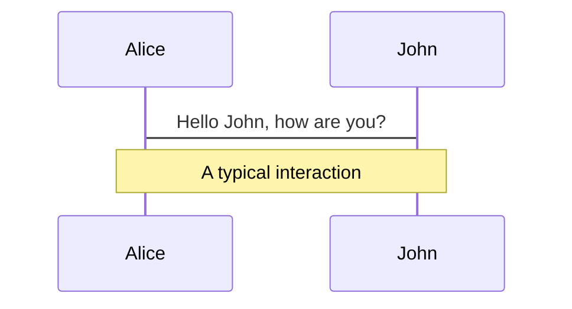
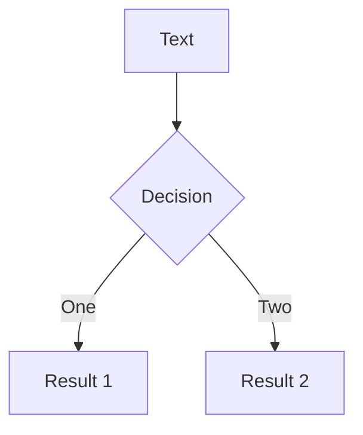
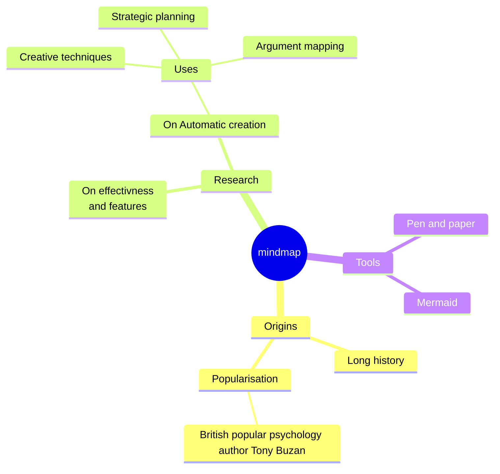
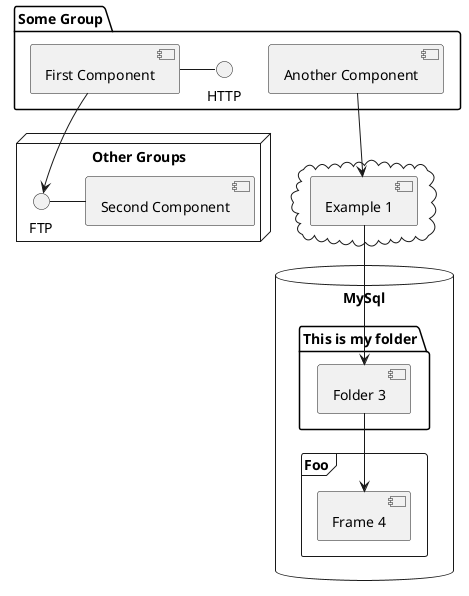

# Serving dynamic CliMA content to the web

Alexandre A. Renchon

<div class="pt-12">
  <span @click="$slidev.nav.next" class="px-2 py-1 rounded cursor-pointer" hover="bg-white bg-opacity-10">
    Press Space for next page <carbon:arrow-right class="inline"/>
  </span>
</div>

<div class="abs-br m-6 flex gap-2">
  <button @click="$slidev.nav.openInEditor()" title="Open in Editor" class="text-xl slidev-icon-btn opacity-50 !border-none !hover:text-white">
    <carbon:edit />
  </button>
  <a href="https://github.com/slidevjs/slidev" target="_blank" alt="GitHub"
    class="text-xl slidev-icon-btn opacity-50 !border-none !hover:text-white">
    <carbon-logo-github />
  </a>
</div>

<!--
The last comment block of each slide will be treated as slide notes. It will be visible and editable in Presenter Mode along with the slide. [Read more in the docs](https://sli.dev/guide/syntax.html#notes)
-->

---

# What is Slidev?

Slidev is a slides maker and presenter designed for developers, consists of the following features

- 📝 **Text-based** - focus on the content with Markdown, and then style them later
- 🎨 **Themable** - theme can be shared and used with npm packages
- 🧑‍💻 **Developer Friendly** - code highlighting, live coding with autocompletion
- 🤹 **Interactive** - embedding Vue components to enhance your expressions
- 🎥 **Recording** - built-in recording and camera view
- 📤 **Portable** - export into PDF, PNGs, or even a hostable SPA
- 🛠 **Hackable** - anything possible on a webpage

<br>
<br>

Read more about [Why Slidev?](https://sli.dev/guide/why)

<!--
You can have `style` tag in markdown to override the style for the current page.
Learn more: https://sli.dev/guide/syntax#embedded-styles
-->

<style>
h1 {
  background-color: #2B90B6;
  background-image: linear-gradient(45deg, #4EC5D4 10%, #146b8c 20%);
  background-size: 100%;
  -webkit-background-clip: text;
  -moz-background-clip: text;
  -webkit-text-fill-color: transparent;
  -moz-text-fill-color: transparent;
}
</style>

<!--
Here is another comment.
-->

---
layout: iframe
url: https://climatearchive.org/
scale: 0.6
---


---
layout: iframe-right
url: https://clima.github.io/ClimaLSM.jl/previews/PR214/dynamicdocs/pages/vegetation/farquhar_model/
scale: 0.6 
---

# Why create web apps?

- Accessible
- Communication: student, funders, scientists
- Gain time (no install, precompile etc.)
- Attract communities (e.g., ecologists) unfamiliar with coding or Julia
- Attract attention (e.g., climatearchive retweeted 1000s of times, permanent museum exhibit...)

---
layout: two-cols
---

# Simplicity & CI

- ParamViz.jl package: short script for each app
- Script to generate all apps (ClimaLSM.jl/docs) -->
- .yml file to run that script when PR merged on main: no need to manually connect to server

::right::

```julia
# Create server
IP = "127.0.0.1"
port = 9385
server = Server(IP, port; proxy_url="https://clima.westus3.cloudapp.azure.com/jsserve/")

# Load and create apps
include("leaf_An.jl"); An_app = An_app_f()
An_app = An_app_f() # need to run twice for unicode character... (bug)
include("Beer.jl"); beer_app = Beer_app_f()
beer_app = Beer_app_f()
include("hetero_resp.jl") # DAMM Rh
Rh_app = Rh_app_f(); Rh_app = Rh_app_f(); 
include("leaf_An_ci.jl") # An_ci
An_ci_app = An_ci_app_f(); An_ci_app = An_ci_app_f(); 

# Route apps
route!(server,"/leaf_An"=>An_app)
route!(server,"/beer_APAR"=>beer_app)
route!(server,"/leaf_An_ci"=>An_ci_app)
route!(server,"/Rh"=>Rh_app)
```

---
layout: iframe-right
url: https://simondanisch.github.io/JSServe.jl/stable/
scale: 0.6
---

# Visualize CliMA output, Simon Danish example

- note: adding animation (e.g., arrows for wind) would be easy
- can also be automated, adjusted when new output created

---
layout: iframe-right
url: https://simondanisch.github.io/JSServe.jl/stable/widgets.html
scale: 0.6
---

# Dashboard widgets for interaction:

- button (e.g., "run")
- text input (e.g., parameters)
- menu (e.g., submodels)
- slider 
- upload/download (e.g., inputs or outputs files)
- check box

---
layout: iframe-right
url: https://cupoftea.earth/menu2/
scale: 0.6 
---

# Potential to use database: example 1

- DAMM parameters fit of FLUXNET & COSORE sites
- Farquhar, Medlyn, radiative transfer, etc.
- note: CUP of TEA is previous work I presented to Gary Geernaert, DOE BER EESSD director, it went great!
- note2: this was very preliminary and wasn't using a server... could do much better now.  

---
layout: image-right
image: ./images/Topt2.png
---

# Potential to use database: example 2

- Emergent properties model vs. data: up-to-date rather than one-off publication
- So many examples of this, always the same: empirical pattern observed, "model should consider it"
- We could have a library of such emergent pattern obs. vs. model that stays up to date (as model and data evolve)

---

# Run CliMA in the web

- Button "run" generates animation of output and a file
- UI to change parameters 
- UI to switch between submodels (modularity) 
- Only OK for simple code (e.g., ClimaLSM single site)
- Probably limited to ~ 20 simultaneous users right now, soon 50 (Simon Danish)

---

# Current framework

- Microsoft Azure virtual machine (Ubuntu)
- NGINX to make it a dynamic web server 
- Let's Encrypt for https certificate
- Julia deps: JSServe, WGLMakie, ClimaLSM, (ParamViz)  
- Alternative, probably cheaper: use a personal computer. Need stable IP (fee to internet provider) & computer on 100% of time (electricity)
- Solution above may allow for more data storage (add drive...), not sure of Azure costs


---
layout: default
---

# Table of contents

```
<Toc minDepth="1" maxDepth="5"></Toc>
```

<Toc></Toc>

---
transition: slide-up

level: 2
---

# Navigation

Hover on the bottom-left corner to see the navigation's controls panel, [learn more](https://sli.dev/guide/navigation.html)

### Keyboard Shortcuts

|     |     |
| --- | --- |
| <kbd>right</kbd> / <kbd>space</kbd>| next animation or slide |
| <kbd>left</kbd>  / <kbd>shift</kbd><kbd>space</kbd> | previous animation or slide |
| <kbd>up</kbd> | previous slide |
| <kbd>down</kbd> | next slide |

<!-- https://sli.dev/guide/animations.html#click-animations -->

<p v-after class="absolute bottom-23 left-45 opacity-30 transform -rotate-10">Here!</p>

---
layout: image-right
image: https://source.unsplash.com/collection/94734566/1920x1080
---

# Code

Use code snippets and get the highlighting directly![^1]

```ts {all|2|1-6|9|all}
interface User {
  id: number
  firstName: string
  lastName: string
  role: string
}

function updateUser(id: number, update: User) {
  const user = getUser(id)
  const newUser = { ...user, ...update }
  saveUser(id, newUser)
}
```

<arrow v-click="3" x1="400" y1="420" x2="230" y2="330" color="#564" width="3" arrowSize="1" />

[^1]: [Learn More](https://sli.dev/guide/syntax.html#line-highlighting)

<style>
.footnotes-sep {
  @apply mt-20 opacity-10;
}
.footnotes {
  @apply text-sm opacity-75;
}
.footnote-backref {
  display: none;
}
</style>

---

# Components

<div grid="~ cols-2 gap-4">
<div>

You can use Vue components directly inside your slides.

We have provided a few built-in components like `<Tweet/>` and `<Youtube/>` that you can use directly. And adding your custom components is also super easy.

```html
<Counter :count="10" />
```

<!-- ./components/Counter.vue -->
<Counter :count="10" m="t-4" />

Check out [the guides](https://sli.dev/builtin/components.html) for more.

</div>
<div>

```html
<Tweet id="1390115482657726468" />
```

<Tweet id="1390115482657726468" scale="0.65" />

</div>
</div>

<!--
Presenter note with **bold**, *italic*, and ~~striked~~ text.

Also, HTML elements are valid:
<div class="flex w-full">
  <span style="flex-grow: 1;">Left content</span>
  <span>Right content</span>
</div>
-->


---
class: px-20
---

# Themes

Slidev comes with powerful theming support. Themes can provide styles, layouts, components, or even configurations for tools. Switching between themes by just **one edit** in your frontmatter:

<div grid="~ cols-2 gap-2" m="-t-2">

```yaml
---
theme: default
---
```

```yaml
---
theme: seriph
---
```


</div>

Read more about [How to use a theme](https://sli.dev/themes/use.html) and
check out the [Awesome Themes Gallery](https://sli.dev/themes/gallery.html).

---
preload: false
---

# Animations

Animations are powered by [@vueuse/motion](https://motion.vueuse.org/).

```html
<div
  v-motion
  :initial="{ x: -80 }"
  :enter="{ x: 0 }">
  Slidev
</div>
```

<div class="w-60 relative mt-6">
  <div class="relative w-40 h-40">
    
    
    
  </div>

  <div
    class="text-5xl absolute top-14 left-40 text-[#2B90B6] -z-1"
    v-motion
    :initial="{ x: -80, opacity: 0}"
    :enter="{ x: 0, opacity: 1, transition: { delay: 2000, duration: 1000 } }">
    Slidev
  </div>
</div>

<!-- vue script setup scripts can be directly used in markdown, and will only affects current page -->
<script setup lang="ts">
const final = {
  x: 0,
  y: 0,
  rotate: 0,
  scale: 1,
  transition: {
    type: 'spring',
    damping: 10,
    stiffness: 20,
    mass: 2
  }
}
</script>

<div
  v-motion
  :initial="{ x:35, y: 40, opacity: 0}"
  :enter="{ y: 0, opacity: 1, transition: { delay: 3500 } }">

[Learn More](https://sli.dev/guide/animations.html#motion)

</div>

---

# LaTeX

LaTeX is supported out-of-box powered by [KaTeX](https://katex.org/).

<br>

Inline $\sqrt{3x-1}+(1+x)^2$

Block
$$
\begin{array}{c}

\nabla \times \vec{\mathbf{B}} -\, \frac1c\, \frac{\partial\vec{\mathbf{E}}}{\partial t} &
= \frac{4\pi}{c}\vec{\mathbf{j}}    \nabla \cdot \vec{\mathbf{E}} & = 4 \pi \rho \\

\nabla \times \vec{\mathbf{E}}\, +\, \frac1c\, \frac{\partial\vec{\mathbf{B}}}{\partial t} & = \vec{\mathbf{0}} \\

\nabla \cdot \vec{\mathbf{B}} & = 0

\end{array}
$$

<br>

[Learn more](https://sli.dev/guide/syntax#latex)

---

# Diagrams

You can create diagrams / graphs from textual descriptions, directly in your Markdown.

<div class="grid grid-cols-4 gap-5 pt-4 -mb-6">









</div>

[Learn More](https://sli.dev/guide/syntax.html#diagrams)

---
src: ./pages/multiple-entries.md
hide: false
---

---
layout: center
class: text-center
---

# Learn More

[Documentations](https://sli.dev) · [GitHub](https://github.com/slidevjs/slidev) · [Showcases](https://sli.dev/showcases.html)
